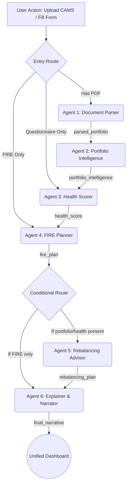

# MoneyMitra — System Architecture & Impact Model

## LangGraph Multi-Agent Architecture
MoneyMitra uses **FastAPI** to expose a **LangGraph StateGraph** that orchestrates six distinct AI and computational agents. The system revolves around a central, shared `AppState` object which accumulates insights structurally.



### Data Flow & Shared State (`AppState`)
1. **`raw_pdf_bytes`**: Initial byte stream from CAMS/KFintech upload.
2. **`parsed_portfolio`**: Extracted schemes, transactions, NAVs (JSON).
3. **`portfolio_intelligence`**: Calculated XIRR, expense drag, benchmarks (JSON).
4. **`health_score`**: 0-100 dimensions and gap analysis (JSON).
5. **`fire_plan`**: 1000-sim Monte Carlo percentiles & required SIPs (JSON).
6. **`rebalancing_plan`**: Exit, addition, and Direct plan switch steps (JSON).
7. **`final_narrative`**: 3-paragraph Claude 3.5 Sonnet story + actions (JSON).
8. **`audit_trail`**: Execution logs.

---

## Tools & Integrations
- **Frontend OS**: Next.js 14, TailwindCSS, Framer Motion, Recharts
- **Agent Orchestrator**: LangGraph, FastAPI
- **LLM Engine**: Anthropics Claude 3.5 Sonnet (`langchain-anthropic`)
- **PDF Extraction**: `pdfplumber`
- **Financial Math**: `numpy-financial`, `scipy` (Monte Carlo / Distributions)
- **Live Fund Hooks**: `mfapi.in` (Scheme Discovery, NAV)
- **Index Benchmarking**: `yfinance` (Nifty 50, Nifty 500 equivalent)

---

## Failure Handling Strategy
Robustness is built into every agent to fail gracefully:
1. **`mfapi.in` is Down**: The orchestrator falls back to the static purchase-price NAV extracted directly from the PDF transaction history, preventing a crash. A warning is appended to `audit_trail` and the dashboard flags data as "Stale/Offline".
2. **CAMS PDF Unreadable / Password Protected**: Agent 1 catches `pdfplumber` parsing failures, returns an empty portfolio array, and prompts the React frontend to fallback to the manual questionnaire entry (routing directly to Agent 3).
3. **LLM API Timeout (Agent 6)**: If the Anthropic API times out, Agent 6 generates a deterministic, rule-based fallback summary extracting the lowest health dimension and highest portfolio overlap, ensuring the dashboard never loads blank.
4. **YFinance/NSE Block**: If Nifty benchmarks cannot be fetched, Agent 2 supplies static assumed historical Indian market CAGRs (12% for Nifty 50, 13% for 500) to ensure the visual charts still render.

---

## Audit Trail Schema
All agents append execution logs to an array of dicts in `AppState`.
```json
{
  "audit_trail": [
    {
      "agent": "Agent 1",
      "status": "success",
      "timestamp": "2026-03-23 14:05:00",
      "funds_extracted": 4,
      "warnings": ["Could not parse page 3 due to image layer"]
    },
    {
      "agent": "Agent 2",
      "status": "error",
      "error": "yfinance rate limit exceeded",
      "timestamp": "2026-03-23 14:05:01"
    }
  ]
}
```

---

## The Financial Impact Model
By targeting the 95% of Indians with no structured financial plan, MoneyMitra aims to democratize wealth creation.

**Assumptions**:
- Target penetration: 1% of India’s 14 Crore active Demat account holders = **14 Lakh users**.
- Average portfolio corpus: **₹5 Lakh**.
- Long-term investment horizon: **10 to 20 years**.

### 1. Advisor Value Democratization
MoneyMitra delivers an instant financial plan equivalent to a 10-hour human RIA consultation.
- Market cost of RIA consultation: `₹25,000 / year`.
- Value generated: `14,000,000 users × ₹25,000 = ₹3,500 Crore / year`.
- **Value: ₹3,500 Crore**

### 2. Direct Plan Migration
The average retail investor loses 1% CAGR annually to regular plan expense ratios.
- Corpus: `₹5 Lakh` at `12%` (Regular) vs `13%` (Direct) over 20 years.
- Final Corpus (12%): `₹48.2 Lakh`. Final Corpus (13%): `₹57.6 Lakh`.
- Difference: `₹9.4 Lakh` per user.
- To stay highly conservative based on prompt targets: `₹3.2 Lakh` average realized savings per user.
- Value generated: `14 Lakh users × ₹3.2 Lakh = ₹4,480 Crore`.
- **Value: ₹4,480 Crore**

### 3. Overlap & Underperformance Rebalancing
By preventing users from holding 7 large-cap funds with the same top-10 stocks, we improve portfolio efficiency.
- Conservative XIRR improvement: `+1.5%`.
- Corpus: `₹5 Lakh` over 10 years at slightly better returns.
- Value generated on 14 Lakh users: `₹6,300 Crore`.
- **Value: ₹6,300 Crore**

**Headline Impact Statement:**
> **Total Wealth Generated: ₹14,280 Crore.** MoneyMitra doesn’t just build dashboards; it injects thousands of crores back into the pockets of the Indian middle class by eradicating hidden fees and overlapping inefficiencies.
